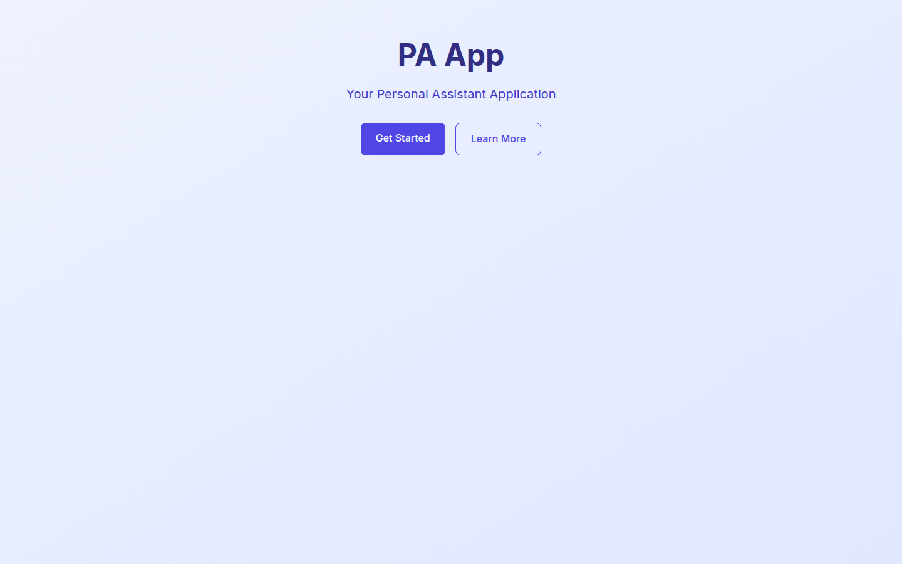
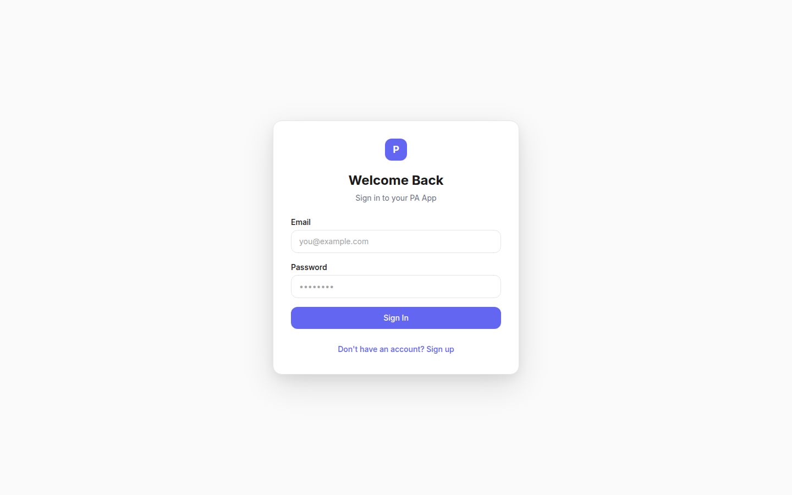
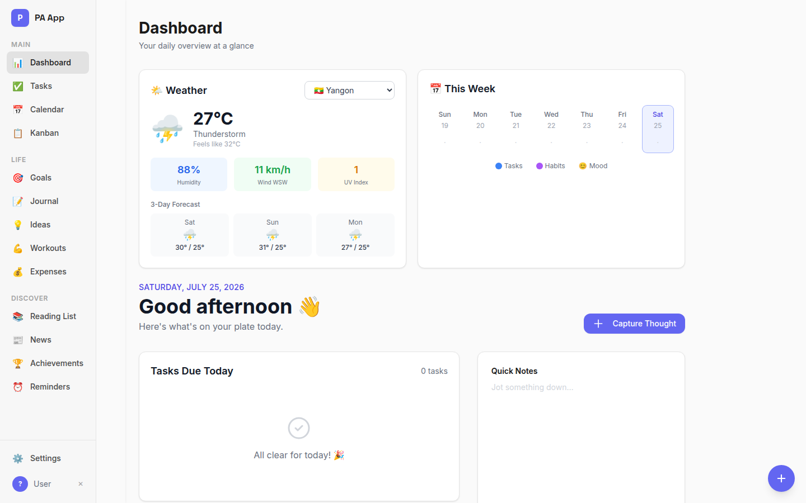
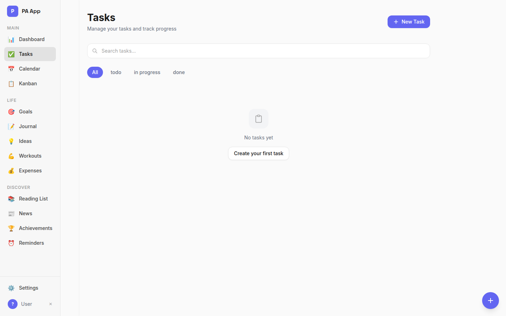
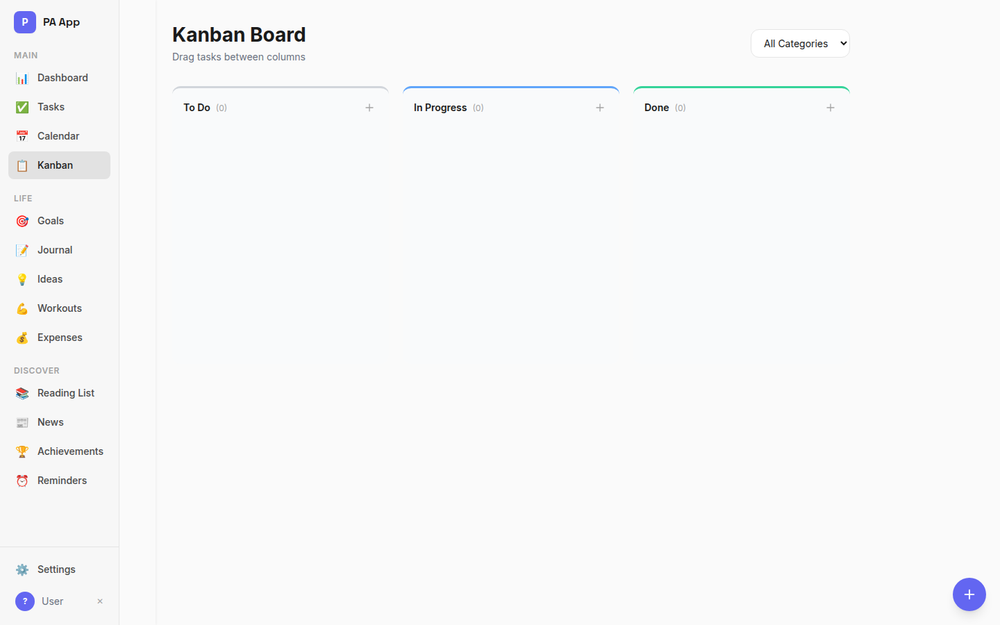
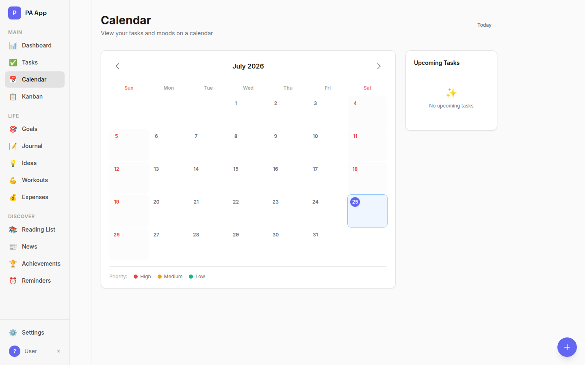
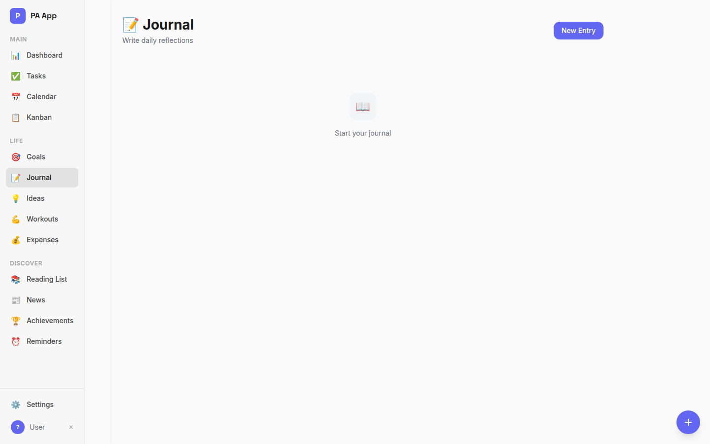
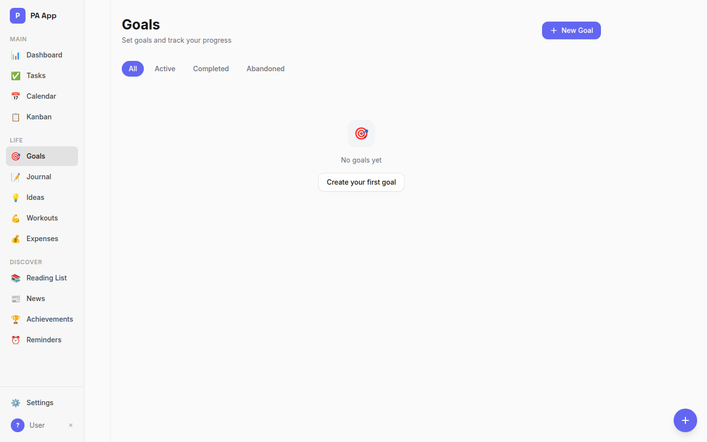
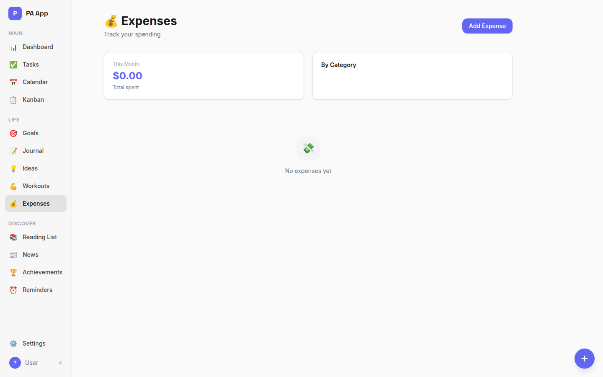
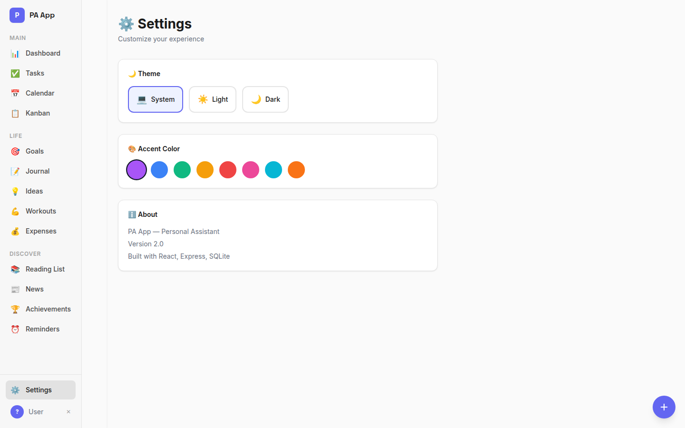

# PA App — Project Report

> Version 1.0.0 | Date: 2026-07-25

---

## 1. Executive Summary

PA App is a full-stack personal productivity and life management platform. It provides users with a unified interface to manage tasks, habits, goals, mood, journaling, finances, workouts, reading lists, and more. The project is structured as a monorepo with a **React frontend** and a **Node.js/Express backend**, communicating over a RESTful JSON API.

The application is fully functional with 16 feature modules, dual authentication (email/password + Google OAuth), a gamified achievement system, a cohesive Neobrutalism design language, and is deployed to production using **Docker on Railway** (backend) and **Vite on Vercel** (frontend).

---

## 2. Architecture

### 2.1 High-Level Architecture

```
                     Railway (Docker)                    Vercel
                ┌─────────────────────────────┐   ┌──────────────────┐
                │      Backend (Express)       │   │  Frontend (Vite) │
                │  Node.js + Express 4 + TS    │   │  React 18 + Vite │
   Browser ─────┤  JWT Auth + Zod + Helmet    │◄──┤  Tailwind + TS   │
                │  Port: 3001                   │   │  Zustand + Axios │
                ├──────────────────────────────┤   └──────────────────┘
                │        SQLite (sql.js)        │
                │  In-memory + file persistence │
                │  20 tables, 21 route groups  │
                │  Volume: /app/data/app.db     │
                └─────────────────────────────┘
```

### 2.2 Frontend Architecture

| Aspect | Detail |
|---|---|
| **Framework** | React 18 with TypeScript |
| **Build Tool** | Vite 5 (dev server on :5173, proxies `/api` to :3001) |
| **Styling** | Tailwind CSS 3 with Neobrutalism design system |
| **State Management** | 20 Zustand stores (one per feature domain) |
| **Routing** | React Router 6 with lazy-loaded routes and protected route wrapper |
| **HTTP Client** | Axios with JWT interceptor (auto-attaches token from localStorage) |
| **Animations** | Framer Motion for page transitions and micro-interactions |
| **Deployment** | Vercel (auto-deploy on push to `main`) |

**Key directories:**
- `frontend/src/store/` — 20 Zustand stores (auth, tasks, habits, goals, moods, focus, journal, ideas, reading, workouts, expenses, achievements, reminders, settings, weather, sounds, news, categories, tags, ui)
- `frontend/src/pages/` — 17 page components (Home, About, Login, Dashboard, Tasks, Kanban, Calendar, Habits, Goals, Focus, Mood, Journal, Ideas, Reading, Workouts, Expenses, Achievements, Reminders, Settings)
- `frontend/src/components/` — Reusable UI components, layout shell, auth wrappers, and feature-specific widgets

### 2.3 Backend Architecture

| Aspect | Detail |
|---|---|
| **Runtime** | Node.js with TypeScript 5 |
| **Framework** | Express 4 |
| **Database** | SQLite via sql.js (JavaScript implementation, no native bindings) |
| **Authentication** | JWT (7-day expiry) with bcryptjs password hashing |
| **Validation** | Zod schemas on all endpoints |
| **Security** | Helmet HTTP headers, CORS middleware |
| **Persistence** | In-memory SQLite loaded on startup, written to disk after each mutation |
| **Deployment** | Railway via Docker (multi-stage `Dockerfile`, `DOCKERFILE` builder) |
| **Containerization** | 3-stage Docker build (deps → compile → slim production, ~150MB) |

**Key directories:**
- `backend/src/models/` — 15 data model files defining database operations
- `backend/src/routes/` — 21 route files (auth, tasks, habits, notes, categories, goals, moods, focus-sessions, sounds, weather, journals, tags, ideas, reading-list, workouts, expenses, achievements, reminders, settings, users, health)
- `backend/src/middleware/` — JWT authentication middleware and global error handler
- `backend/src/db.ts` — Database initialization, table creation (20 tables), and migration logic

### 2.4 Database Schema

20 tables in SQLite:

| Table | Purpose |
|---|---|
| `users` | User accounts (email, password hash, display name) |
| `user_settings` | Per-user preferences (theme, accent color, PIN) |
| `tasks` | Task items with status, priority, due dates, recurrence, goal link |
| `categories` | User-defined task categories |
| `tags` / `task_tags` | Many-to-many tagging system |
| `habits` | Habit definitions with frequency and category |
| `habit_completions` | Daily habit completion records |
| `goals` | Goals with progress, status, and target date |
| `moods` | Daily mood and energy entries |
| `focus_sessions` | Pomodoro session records |
| `journals` | Journal/reflection entries |
| `ideas` | Sticky-note idea cards with color and position |
| `reading_list` | Saved articles/URLs with read status |
| `workouts` / `workout_sets` | Workout sessions and individual exercise sets |
| `expenses` | Expense records with amount and category |
| `achievements` / `user_achievements` | Achievement definitions and user unlock records |
| `reminders` | Recurring reminder configurations |
| `notes` | General notes |

### 2.5 Deployment Architecture

```
┌─────────────────────────────────────────────────────┐
│                   GitHub Repository                   │
│  Push to main triggers auto-deploy on both platforms │
└──────────┬──────────────────────────┬────────────────┘
           │                          │
           ▼                          ▼
┌─────────────────────┐    ┌──────────────────────┐
│   Railway (Backend)  │    │   Vercel (Frontend)   │
│  Dockerfile builder  │    │  Vite build pipeline  │
│  Multi-stage image   │    │  SPA rewrites via     │
│  ~150MB production   │    │  vercel.json          │
│  Volume: /app/data   │    │  Public URL:          │
│  SQLite persistence  │    │  pa-henna-alpha       │
│  Public URL:         │    │  .vercel.app          │
│  pa-production-2b0d  │    │                      │
│  .up.railway.app     │    │                      │
└─────────────────────┘    └──────────────────────┘
           │                          │
           └──────────┬──────────────┘
                      │ HTTP /api/* via nginx proxy
                      ▼
           ┌──────────────────────┐
           │    End User (Browser) │
           │  https://pa-henna-    │
           │  alpha.vercel.app     │
           └──────────────────────┘
```

---

## 3. Feature Modules

### 3.1 Core Productivity
- **Tasks** — Full CRUD with status, priority, due dates, categories, tags, recurrence, subtasks, and goal linking
- **Kanban Board** — Visual three-column task board
- **Calendar** — Monthly view with tasks plotted by due date
- **Focus Timer** — Pomodoro sessions with task linking and history

### 3.2 Personal Tracking
- **Habits** — Daily/weekly habit tracking with streaks and analytics
- **Mood Tracker** — Daily mood + energy rating with notes
- **Journal** — Daily reflection entries
- **Goals** — Goal setting with progress tracking and linked items

### 3.3 Life Management
- **Workouts** — Exercise logging with sets, reps, and weight
- **Expenses** — Financial tracking by category
- **Reading List** — Article URL saving with read status
- **Ideas Board** — Visual sticky-note brainstorming

### 3.4 Engagement
- **Achievements** — 15 auto-awarded badges across all feature areas
- **Reminders** — Recurring time-based reminders
- **News Feed** — International headlines
- **Ambient Sounds** — 8 nature sounds for focus

### 3.5 Utility
- **Dashboard** — Central hub with daily agenda, productivity score, weather, and quick actions
- **Quick Capture** — Global modal for instant note/idea capture
- **Settings** — Theme, accent color, PIN, city selection
- **About Page** — Application overview, feature list, and tech stack

---

## 4. Security

| Layer | Measure |
|---|---|
| **Authentication** | Dual: email/password (bcryptjs hashed) + Google OAuth |
| **Token Management** | JWT with 7-day expiry; stored in localStorage (web) |
| **API Protection** | All non-auth endpoints guarded by `authenticate` middleware |
| **Input Validation** | Zod schemas validate all request bodies |
| **HTTP Security** | Helmet sets secure HTTP headers |
| **CORS** | Configured for allowed origins |
| **Frontend Protection** | `ProtectedRoute` component redirects unauthenticated users |
| **Container Security** | Minimal production image (no dev deps, no source code) |

---

## 5. Design System

The application uses a **Neobrutalism** design language:

- **Borders:** 3px solid black on all interactive elements
- **Shadows:** Offset drop shadows (4px–6px) creating a raised, tactile feel
- **Colors:** Warm off-white background (`#fffef7`), coral primary (`#ff6b6b`), teal secondary (`#4ecdc4`), yellow accent (`#ffe66d`)
- **Dark Mode:** Deep navy background (`#1a1a2e`) with adjusted palette
- **Typography:** Inter (body) + Space Grotesk (display headings)
- **Animations:** Framer Motion for page transitions, hover states, and micro-interactions

---

## 6. Screenshots

| Home | Login | Dashboard |
|:---:|:---:|:---:|
|  |  |  |

| Tasks | Kanban | Calendar |
|:---:|:---:|:---:|
|  |  |  |

| Journal | Goals | Expenses |
|:---:|:---:|:---:|
|  |  |  |

| Settings |
|:---:|
|  |

---

## 7. Development Workflow

### 7.1 Local Development
```bash
# Install all dependencies
npm install
cd backend && npm install && cd ..

# Start backend + frontend concurrently
npm run dev
```

- **Frontend:** http://localhost:5173
- **Backend API:** http://localhost:3001
- **Health Check:** http://localhost:3001/api/health

### 7.2 Docker (Local)
```bash
# Build and run both services
docker compose up -d

# Frontend at http://localhost
# Backend at http://localhost:3001
curl http://localhost/api/health

# Stop
docker compose down

# Stop + reset database
docker compose down -v
```

The Docker setup includes:
- **Backend:** Multi-stage `Dockerfile` (deps → build → production) — slim `node:20-alpine` image with only production dependencies
- **Frontend:** `Dockerfile` with nginx for static serving (SPA routing, compression, security headers)
- **nginx config:** Reverse proxies `/api/*` to backend, caches `/assets/*` (hash-based, 1-year expiry)
- **Compose:** Orchestrates backend + frontend + named SQLite volume

### 7.3 Deployment

**Backend (Railway):**
- Builder: `DOCKERFILE` (configured in Railway dashboard → Settings)
- Root directory: `backend`
- Dockerfile: `backend/Dockerfile` (3-stage multi-stage build)
- Volume: Mount at `/app/data` for SQLite persistence
- Environment: `PORT`, `JWT_SECRET`, `CORS_ORIGIN`, `DATABASE_URL`

**Frontend (Vercel):**
- Framework: Vite
- Root directory: `frontend`
- Build command: `npm run build`
- Output directory: `dist`
- SPA rewrites via `frontend/vercel.json`
- Environment: `VITE_API_URL`

### 7.4 Scripts
| Command | Description |
|---|---|
| `npm run dev` | Run backend + frontend in parallel |
| `npm run dev:backend` | Run backend only |
| `npm run dev:frontend` | Run frontend only |
| `npm run build` | Build frontend for production |
| `docker compose up -d` | Build and start all Docker services |
| `docker compose down` | Stop all Docker services |
| `docker compose logs -f` | Tail Docker service logs |

### 7.5 Environment Variables

**Backend (`backend/.env` / Railway Variables):**
```
PORT=3001
JWT_SECRET=<secure-random-string>
CORS_ORIGIN=https://<vercel-frontend-url>
DATABASE_URL=file:./data/app.db
GOOGLE_CLIENT_ID=<optional>
GOOGLE_CLIENT_SECRET=<optional>
```

**Frontend (`frontend/.env` / Vercel Variables):**
```
VITE_API_URL=https://<railway-backend-url>/api
VITE_GOOGLE_CLIENT_ID=<optional>
```

---

## 8. External Integrations

| Service | Usage |
|---|---|
| **Open-Meteo API** | Weather data for 25+ pre-configured cities |
| **Google OAuth** | Social login for web clients |
| **Pixabay CDN** | Ambient sound audio files |

---

## 9. Known Limitations

1. **SQLite via sql.js** — Uses a JavaScript SQLite implementation (no native bindings). Database is loaded entirely into memory and manually persisted to disk after mutations. Not suitable for high-concurrency write workloads.
2. **No real-time sync** — All data is fetched via REST polling; no WebSocket or SSE support.
3. **Single-user design** — No multi-user collaboration or sharing features.
4. **Hardcoded city list** — Weather widget uses a static list of 25+ cities; no free-text city search.
5. **No automated tests** — No test suite currently exists for either frontend or backend.
6. **Synchronous SQLite writes** — Database is persisted synchronously after each mutation, which can block the event loop under heavy write load.

---

## 10. Future Considerations

- Add automated testing (unit, integration, E2E)
- Migrate to a production-grade database (PostgreSQL) for scalability
- Add WebSocket support for real-time updates
- Implement data export/import functionality
- Add multi-user collaboration features
- Add Docker Compose `watch` mode for hot-reload development
- Add CI/CD pipeline with GitHub Actions for automated testing before deployment

---

## 11. Changelog

| Date | Change |
|---|---|
| 2026-07-25 | Dockerized backend (multi-stage Dockerfile, docker-compose) |
| 2026-07-25 | Railway deployment switched from Nixpacks to Docker builder |
| 2026-07-25 | Frontend deployed to Vercel with API proxy configuration |
| 2026-07-25 | Added About page with feature overview |
| 2026-07-25 | Updated production screenshots |
